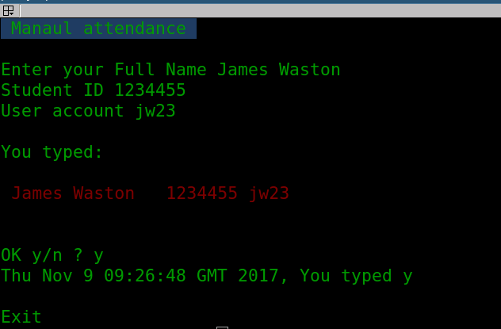

# What is this script for

This script intends to replace the paper registration by the students at the exercises classes. It also intends to reduce misreading from students writing styles and have corrent registration of the attendance in the sessions. 

# How to use it

`./manualAtendance`

It will create a file with te day and time of the day, which contains the name, id and account as in the following screen shot.

