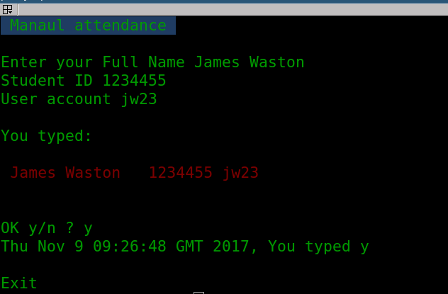

# What is this script for

This script intends to replace the paper registration by the students at the exercises classes. It also intends to reduce misreading from students writing styles and have corrent registration of the attendance in the sessions. 

# How to use it

`./manualAtendance`

It asks the name, student id and account of the student as in the following figure.



# Expected output
The output contains the name, student id and account separated by tab spaces, as bellow:

```
percy@xps:atendance$ cat 20171109
James Watso 	1234455 	mr80
```

